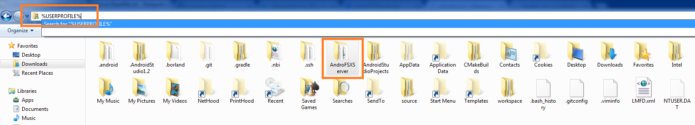
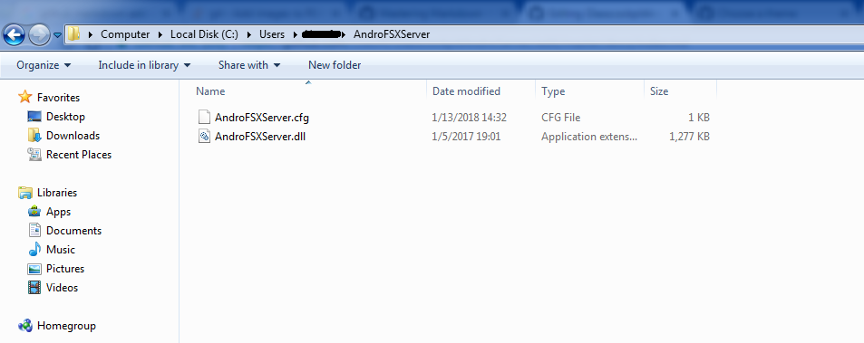

# Introduction
This DLL (Dynamic Link Library) app is an enhancement tool to be used to support [Glasscockpit for FSX](https://play.google.com/store/apps/details?id=com.donotspeak.GlassCockpitFSX&hl=en). As a server application this DLL is used to transmit flight simulation data from FSX or P3D installed on host computers to android application ( [Glasscockpit for FSX](https://play.google.com/store/apps/details?id=com.donotspeak.GlassCockpitFSX&hl=en) ).

# Requirement
- **FSX / P3D.**   
Flight Simulation application on the host side computer.
- **Simconnect SDK on the host computer.**   
Simconnect SDK version is depend on FSX and P3D version.
- **[Glasscockpit for FSX](https://play.google.com/store/apps/details?id=com.donotspeak.GlassCockpitFSX&hl=en) installed on android device.**   
Client application aircraft cockpit devices: PFD, EICAS, ECAM, etc.

# Installation
This application can be installed in the following way,
- Create `<AndroFSXServer>` folder in `<%USERPROFILE%>` directory.   
 
- Extract, then place `<AndroFSXServer.cfg>` and `<AndroFSXServer.dll>` inside `<%USERPROFILE%\AndroFSXServer>` folder   
 
 
# Set up
After we're finish with installation step now we have to configure server (host computer side) according to client (android side) ip address configuration.
1. On server side / host computer side. Update simulator dll.xml configuration file :
   1. **FSX** users dll.xml configuration file can be found in this path `<%USERPROFILE%\AppData\Roaming\Microsoft\FSX>`
   1. **PREPAD3D v2** users dll.xml configuration file can be found in this path `<%USERPROFILE%\AppData\Roaming\Lockhead Martin\Prepar3D v2>`
   
   In dll.xml we need to add configuration code so FSX or P3D will know where the addon dll is placed. add below code to dll.xml   
   ```
   <Launch.Addon>
     <Name>Android FSX</Name>
     <Disabled>False</Disabled>
     <ManualLoad>False</ManualLoad>
     <Path>C:\Users\<USERNAME>\AndroFSXServer\AndroFSXServer.dll</Path>
   </Launch.Addon>
   ```   
1. Update Host computer configuration.
   1. Find yours smartphone or tablet ip address. Can be found in setup page, slide left to open menu page then tab on gear icon.   
   
   1. Update AndroFSXServer.cfg, add smartphone or tablet ip address to AndroFSXServer.cfg   
   
