# Introduction
This application is mockup version of a many aircraft display systems. which you can install on android device.

# Installation
You can install this application from [Google Play Store](https://play.google.com/store/apps/details?id=com.donotspeak.GlassCockpitFSX)

# Set Up
There no set up step require for this application, Set Up can be done from server side application (Host computer) see [Set Up](index-server-app.md#set-up) section on FSX or P3D DLL (Dynamic Link Library) manual and user guide.

# Usage
After finishing set up on host computer (server side) all you have to do is start FSX or P3D application, Then confirm if any pop up appear regarding DLL application addon.   

On android client application ([Glasscockpit for FSX](https://play.google.com/store/apps/details?id=com.donotspeak.GlassCockpitFSX)) menu page can be accessed by slide right the setup screen.   

List menu that can be accessed from ([Glasscockpit for FSX](https://play.google.com/store/apps/details?id=com.donotspeak.GlassCockpitFSX)) application is:   
   - **BOEING 747**
      - **[PFD](https://en.wikipedia.org/wiki/Primary_flight_display) (Primary Flight Display).**   
      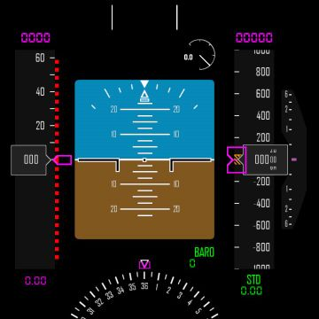
      - **[EICAS](https://id.wikipedia.org/wiki/Engine-indicating_and_crew-alerting_system) (Engine Indicating and Crew Alerting System).**   
      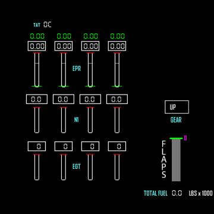
      - **EICAS (Engine Indicating and Crew Alerting System) LOWER.**   
      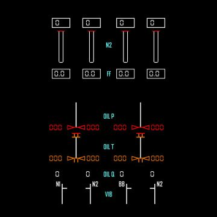
   - **AIRBUS 320**
      - **[PFD](https://en.wikipedia.org/wiki/Primary_flight_display) (Primary Flight Display)** AIRBUS MODEL.   
      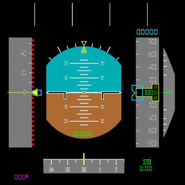
      - **[ECAM](https://en.wikipedia.org/wiki/Electronic_centralised_aircraft_monitor) (Electronic Centralised Aircraft Monitor).**   
      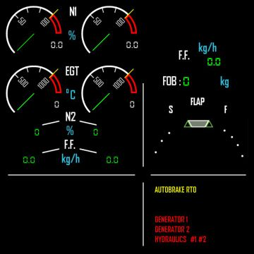
      - **ECAM (Electronic Centralised Aircraft Monitor) ENGINE.**   
      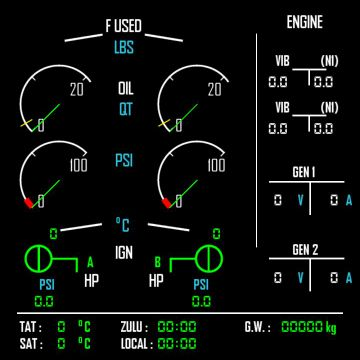
   - **FREE PANELS**
      - **COMPASS.**   
      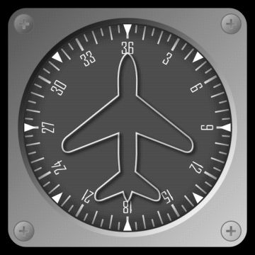
      - **TURN COORDINATOR.**   
      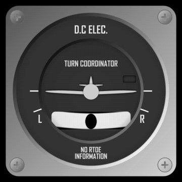
      - **ALTIMETER.**   
      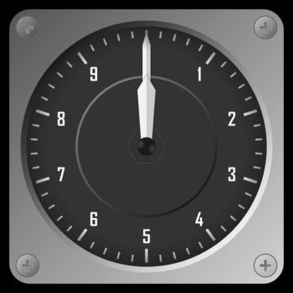
      - **VSI (Vertical Speed Indicator).**   
      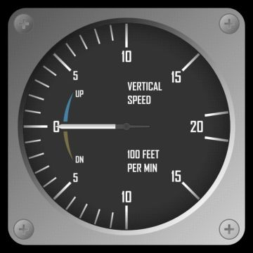
      - **AIRSPEED.**   
      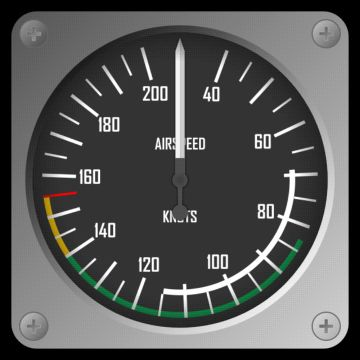
   - **SET UP PAGE**   
   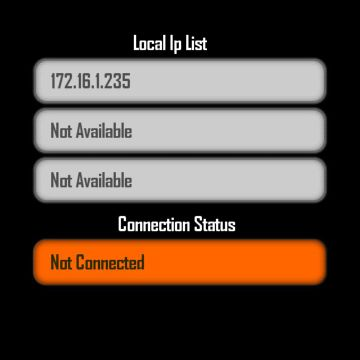
